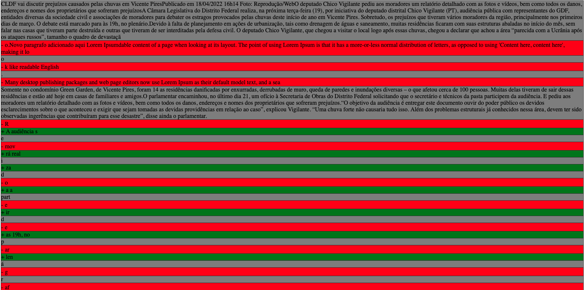
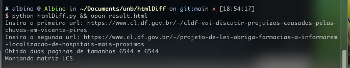
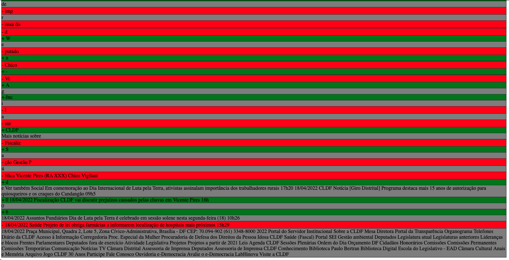

# HTMLDiff

**Número da Lista**: 5 
**Conteúdo da Disciplina**: PD 

## Alunos
|Matrícula | Aluno |
| -- | -- |
| 16/0028361  |  GABRIEL BATISTA ALBINO SILVA |

## Sobre 
O projeto utiliza Programação dinâmica para montar a matriz LCS de duas paginas obtidas via URL a fim de comparar seu conteúdo

## Screenshots

## Instalação 
**Linguagem**: Python 
Descreva os pré-requisitos para rodar o seu projeto e os comandos necessários.

**Python 3.9**

Instalar pacotes via `pip -r requirements.txt`

## Uso 
Apos executar, insira as duas URLs e o programa gerara um arquivo result.html com o diff.

